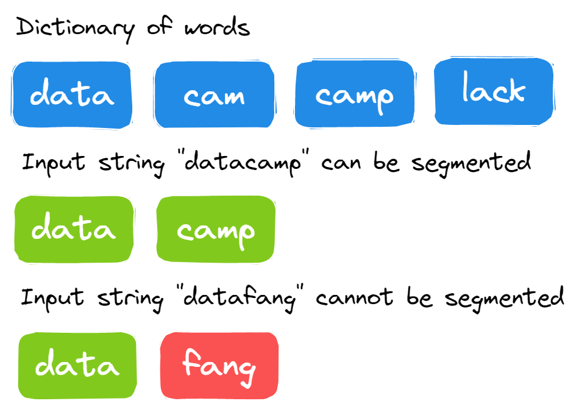

# replacementInString

      It is a simple string manipulation challenge. You have to replace the space with a specific character.  
      
**Example 1:** a user has provided the string “l vey u” and the character “o”, and the output will be “loveyou”.

**Example 2:** a user has provided the string “D t C mpBl ckFrid yS le” and the character “a”, and the output will be “DataCampBlackFridaySale”.

# PerfectSquare

      Given a positive integer num, write a function that returns True if num is a perfect square else False.

# TrailingZerosInFactorial

      Given an integer n, return the number of trailing zeroes in n factorial n! .. we have to first calculate n factorial (n!) and then calculate the number of training zeros. 

# StringSegmentation

      You are provided with a large string and a dictionary/list of the words. You have to find if the input string can be segmented into words using the dictionary/list or not.  
      

