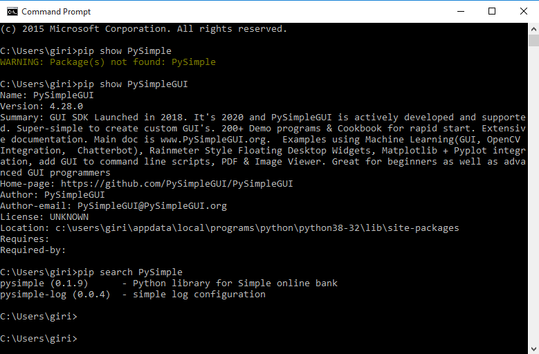

# **Python_Learnings**

## _**Python**_ :

1. Python is an interpreted, object-oriented, high-level programming language with dynamic semantics. 
2. Its high-level built in data structures, combined with dynamic typing and dynamic binding, make it very attractive for Rapid Application Development, as well as for use as a scripting or glue language to connect existing components together. 
3. Python's simple, easy to learn syntax emphasizes readability and therefore reduces the cost of program maintenance. Python supports modules and packages, which encourages program modularity and code reuse. 
4. The Python interpreter and the extensive standard library are available in source or binary form without charge for all major platforms, and can be freely distributed.
5. Often, programmers fall in love with Python because of the increased productivity it provides. Since there is no compilation step, the edit-test-debug cycle is incredibly fast. Debugging Python programs is easy: a bug or bad input will never cause a segmentation fault. 
6. Instead, when the interpreter discovers an error, it raises an exception. When the program doesn't catch the exception, the interpreter prints a stack trace. A source level debugger allows inspection of local and global variables, evaluation of arbitrary expressions, setting breakpoints, stepping through the code a line at a time, and so on. 
7. The debugger is written in Python itself, testifying to Python's introspective power. On the other hand, often the quickest way to debug a program is to add a few print statements to the source: the fast edit-test-debug cycle makes this simple approach very effective. 

## **_Differece between Python 2 & Python 3 Versions_** :

1. Version & usage :

   a. Python_2 :
   
      - Python 2 made code development process easier than earlier versions. It implemented technical details of Python Enhancement Proposal (PEP). Python 2.7 (last version in 2.x ) is no longer under development and in 2020 will be discontinued.
     
   b. Python_3 :
   
      - On December 2008, Python released version 3.0. This version was mainly released to fix problems which exist in Python 2. The nature of these change is such that Python 3 was incompatible with Python 2. It is backward incompatible Some features of Python 3 have been backported to Python 2.x versions to make the migration process easy in Python 3.

2. Key Difference

   - Python 3 syntax is simpler and easily understandable whereas Python 2 syntax is comparatively difficult to understand.
   - Python 3 default storing of strings is Unicode whereas Python 2 stores need to define Unicode string value with "u."
   - Python 3 value of variables never changes whereas in Python 2 value of the global variable will be changed while using it inside for-loop.
   - Python 3 exceptions should be enclosed in parenthesis while Python 2 exceptions should be enclosed in notations.
   - Python 3 rules of ordering comparisons are simplified whereas Python 2 rules of ordering comparison are complex.
   - Python 3 offers Range() function to perform iterations whereas, In Python 2, the xrange() is used for iterations.
   - If your development team is working on a project that depends on specific third-party libraries or software which you are not able to port to Python 3, then Python 2 is the only option available for you.
   

3. Primary difference in Tabluar format

   _a. Difference between Python 3 & Python 2 versions_

   | Basis of comparison | Python 3 | Python 2 |
   | --- | --- | --- |
   | Release Date | 2008 | 2000 |
   | Function print | print ("hello") | print "hello" |
   | Division of Integers | Whenever two integers are divided, you get a float value. | When two integers are divided, you always provide integer value. |
   | Unicode | In Python 3, default storing of strings is Unicode. | To store Unicode string value, you require to define them with "u". |
   | Syntax | The syntax is simpler and easily understandable. | The syntax of Python 2 was comparatively difficult to understand. |
   | Iteration | The new Range() function introduced to perform iterations. | In Python 2, the xrange() is used for iterations. |
   | Exceptions | It should be enclosed in parenthesis. | It should be enclosed in notations. |
   | Leak of variables | The value of variables never changes. | The value of the global variable will change while using it inside for-loop. |
   | Library | Many recent developers are creating libraries which you can only use with Python 3. | Many older libraries created for Python 2 is not forward-compatible. |

   _b. Difference between Python & C programming languages_

   | C | Python |
   | --- | --- |
   | C is mainly used for hardware related applications. | Python is general purpose programming language. |
   | Follows an imperative programming model. | Follows object-oriented programming language |
   | Pointers available in C. | No pointers functionality available. |
   | C is compiled. | Python is interpreted. |
   | A limited number of built-in functions. | Large library of built-in functions. |
   | Code execution is faster than python. | Slower compared to C as python has garbage collection. |
   | Implementing data structures required its functions to be explicitly implemented. | Gives ease of implementing data structures with built-in insert, append functions. |
   | It is compulsory to declare the variable type in C. | No need to declare a type of variable. |
   | C program syntax is harder than python. | Python programs are easier to learn, write and read. |
   | C has compiled language. The complete source code is converted into a machine language which is easier for a computer to understand. | Python on the other hand is interpreted. The interpreter reads each statement line by line. This makes python slower compared to C. |

### **pip**

   pip is a package manager for Python packages. When we install pip, it is added to the system as a command line program which can be run from the command line. We not only use pip to install and uninstall Python packages, it is rather a great tool to create Python virtual environment.
    
   - pip search <package_name>
        
        The above command useful to search a details/content about particular package which is installed on our machine. 
            
   - pip install <package_name>
        
        The above command useful to install new package onto our machine.
                     
   - pip install --no-cache-dir <package_name> 
        
        The above command will do the installation from the python package server , not from cache storage which is present on our machine.
         
   - pip show <package_name>
        
        The above command is usefull when we wanted to know the full info about a specific installed package.
            
   - pip uninstall <package_name>
        
        The above command useful to uninstall the installed package from our machine.
           
   - pip list
        
        The above command will list out all installed packages which is present at our machine.
            
   - pip freeze 
        
        The above command is also does the similar action as pip list does.
           
   - pip install -r <path_to_file>
        
        The above command will do the installation of each package & version from the file which user will specifies <path_to_file>.
            
   - pip install <package_name>==<version_number>
        
        The above command will install specific version of package name.
            Ex : pip install spyder==4.2.0
            
   - pip install --upgrade <package_name>
        
        The above command will installs the upgraded version of package onto system.
            
   - pip check <package_name>
        
        The above command will shows the whether package is being installed without any issues & making sure that there is no breakage.
     
   

### List of Python Script File-Extensions

   Python scripts may have one of several file extensions. Each file extension has a special meaning and purpose.

1. *.py - Regular scripts

2. \*.py3 - (rarely used) Python3 script; Python3 scripts usually end with "\*.py" not "\*.py3"

3. *.pyc - compiled script (Bytecode)

4. *.pyo - optimized pyc bytecode file (As of Python3.5, Python will only use pyc rather than pyo and pyc)

5. *.pyw - Python script for Windows that is executed with pythonw.exe

6. *.pyx - Cython src to be converted to C/C++

7. *.pyd - Python script made as a Windows DLL

8. *.pxd - Cython script which is equivalent to a C/C++ header

9. *.pyi - MyPy stub

10. *.pyi - Stub file (PEP 484)

11. *.pyz - Python script archive (PEP 441); this is a script containing compressed Python scripts (ZIP) in binary form after the standard Python script header

12. *.pywz - Python script archive for MS-Windows (PEP 441); this is a script containing compressed Python scripts (ZIP) in binary form after the standard Python script header

13. \*.py[cod] - wildcard notation in ".gitignore" that means the file may be "\*.pyc", "\*.pyo", or "\*.pyd"

14. *.rpy - RPython script or a Python script containing application or framework-specific features

15. *.pyde - Python script used by Processing (https://processing.org/)

16. *.pyp - Py4D Python Plugin

17. *.pyt - Python declaration file

18. *.xpy - Unknown

19. *.ipynb - Jupyter Notebook file
